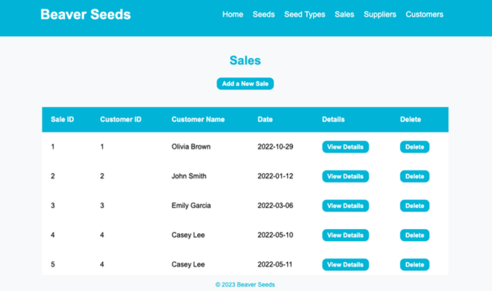
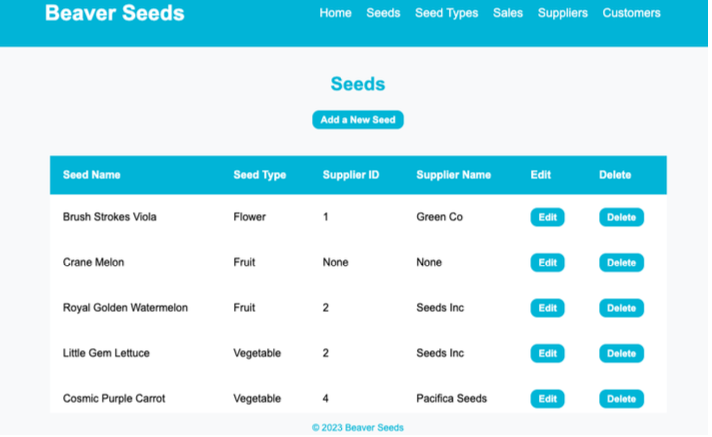

# Beaver Seeds

## Project Overview

**Team**

Sandra Yee and Lisa Fink

**Project Title**

Sales System for Beaver Seeds

**Overview**

Beaver Seeds is a seed store that specializes in domestic heirloom varieties. Seeds are sold from the store’s location in Corvallis, Oregon. Beaver Seeds currently sells 50,000 packets of seeds annually and expects to continue growing. A database driven website will record the quantity of seeds sold to customers to help Beaver Seeds keep track of which seeds are popular with customers. The database driven website will help Beaver Seeds decide which seeds to purchase more of in subsequent years in order to grow their business.

**Project Images**

